.. 2021年6月11日11:06:42

Cortex-M3内核简介
=========================

Cortex-M3是基于ARMv7-M架构的处理器内核，于ARM公司2005年推出，完整的基于Cortex-M3的MCU需要很多其他的组件，
在芯片制造商得到CM3处理器内核的使用授权后，它们就可以把CM3内核用在自己的硅片设计中，
添加存储器，外设，I/O以及其它功能块。

Cortex-M3内核具有以下特点

- 三级流水线设计
- 哈佛总线架构
- 32位寻址，支持4GB存储器空间
- 内嵌NVIC(嵌套中断控制器)，支持最多240个中断请求和8~256个中断优先级。
- 支持多种OS特性，如Systick(节拍定时器)定时器以及影子栈指针等。

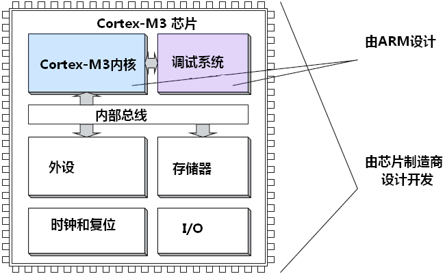

操作模式和状态
----------------

处理器可分为特权和非特权访问等级，特权访问等级可以访问处理器中的所有资源，
而非特权访问等级则意味着有些存储器区域是不能访问的，非特权访问等级也被称为“用户状态”。

Cortex-M3处理器有两种操作状态(调试状态和Thumb状态)和两个模式(处理模式和线程模式)。
关于两个模式介绍如下

- 处理模式：执行中断服务程序(ISR)等异常处理，在处理模式下处理器总是具有特权访问等级。
- 线程模式：在执行普通的应用程序代码时，处理器可以处于特权模式也可以处于非特权访问等级。
  实际上的访问等级由特殊寄存器CONTROL控制。
  
线程模式可以切换使用独立的影子栈指针(SP),这种设计使得应用任务的栈空间可以和OS内核的相互独立，
软件可以将处理器从特权线程模式切换到非特权线程模式，但无法将自身从非特权模式切换到特权模式，
若想要进行该种切换处理器必须借助异常机制。

Cortex-M处理器在启动后默认处于特权线程模式以及Thumb状态，对于不跑OS的应用，
非特权线程模式和影子SP基本用不上。

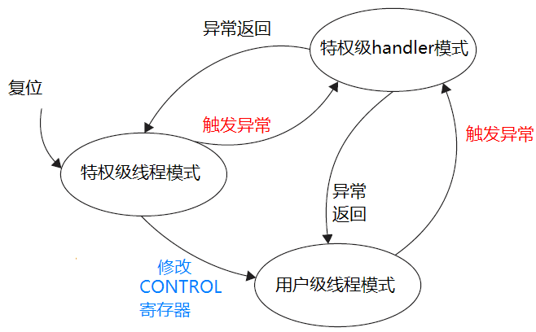

寄存器组   
-----------------

Cortex-M3处理器的寄存器组中有16个寄存器，其中13为32位通用目的寄存器，
其他3个则有特殊用途，如下图所示

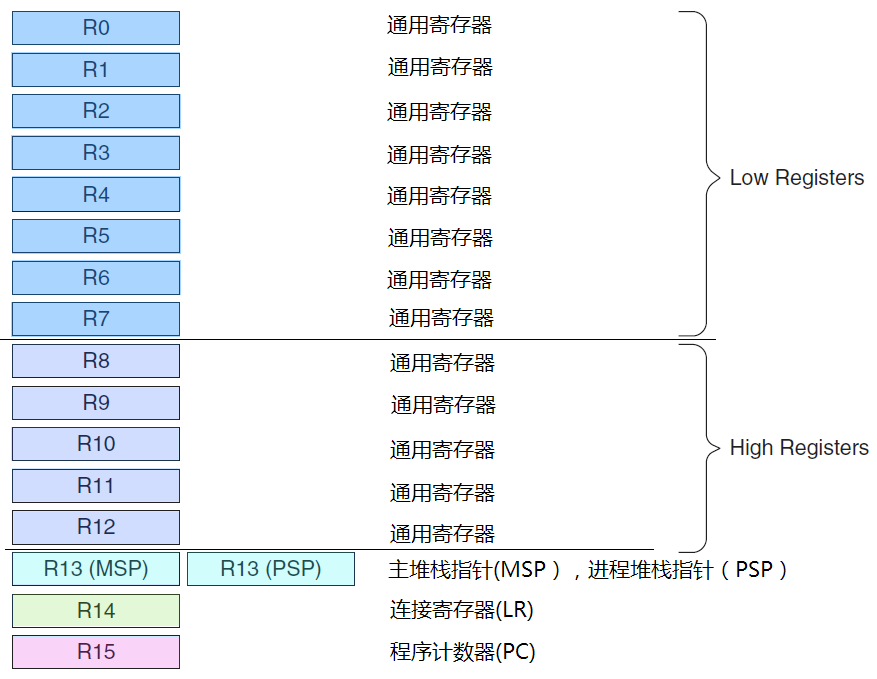

- R0-R12为通用目的寄存器，前8个(R0-R7)也称为低寄存器。
- R13为栈指针，可通过PUSH和POP操作实现栈存储的访问，物理上存在两个栈指针：
  MSP(主栈指针)和PSP(进程栈指针)，在复位后或处理器处于处理模式时，使用的是MSP指针,
  大多数情况下使用到了嵌入式OS才会使用PSP指针。PSP的初始值未定义，而MSP的初始值需要在复位流程中
  从存储器的第一个字中取出。
- R14也被称为链接寄存器(LR),用于函数或子程序调用时返回地址的保存。
- R15为程序计数器(PC)，读操作返回当前指令地址加4，写操作则会引起程序跳转操作。

特殊功能寄存器
-----------------

Cortex-M3在内核水平上搭载了若干特殊功能寄存器，在使用C语言开发应用程序时需要访问这些寄存器
的情形不多，在开发嵌入式OS或者需要高级中断屏蔽特性时，则需要访问他们。
分为以下三类

- 程序状态字寄存器组（xPSR）
- 中断屏蔽寄存器组（PRIMASK, FAULTMASK, BASEPRI）
- 控制寄存器（CONTROL）

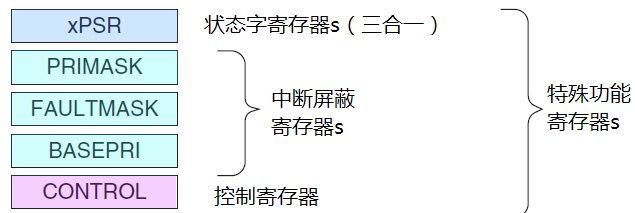

程序状态字寄存器
^^^^^^^^^^^^^^^^^^

其中程序状态字寄存器分为应用PSR(APSR)、执行PSR（EPSR）、中断PSR（IPSR）三个寄存器。
这三个寄存器可通过组合寄存器xPSR访问。位域定义如下

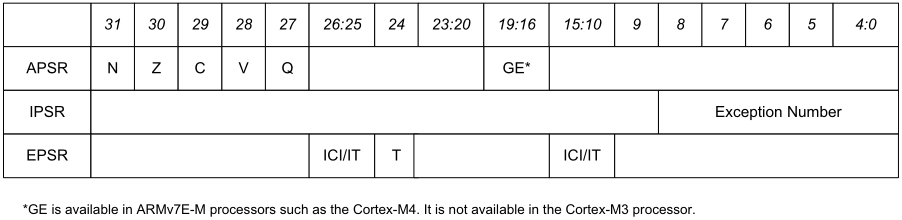

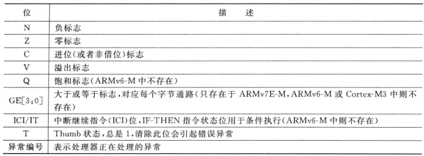

   
异常屏蔽寄存器
^^^^^^^^^^^^^^^

PRIMASK, FAULTMASK 和 BASEPRI寄存器都是用于异常或中断屏蔽，每个异常都有一个优先级，
数值越小优先级越高，这些寄存器可基于优先等级屏蔽异常，只有在特权访问等级下才能对他们进行操作，
默认全部为0，即屏蔽不起作用。

- PRIMASK：只有1位的寄存器。在它被置1后，就关掉所有可屏蔽的异常，
  只剩下NMI和硬件错误可以响应，缺省值为0。

- FAULTMASK：只有1位的寄存器。当它置1时，只有NMI才能响应，所有其它的异常，
  甚至是硬件错误，也通通关闭。它的缺省值也是0。

- BASEPRI：最多有9位（由表达优先级的位数决定）。它定义了被屏蔽优先级的阈值。
  当它被设成某个值后，所有优先级号大于等于此值的中断都被关（优先级号越大，优先级越低）。
  缺省值为0。
  
对于时间-关键任务而言，恰如其分地使用 PRIMASK 和 BASEPRI 来暂时关闭一些中断是非常重要的。
而FAULTMASK则可以被OS用于暂时关闭fault处理机能，这种处理在某个任务崩溃时可能需要。
因为在任务崩溃时，常常伴随着一大堆 faults。在系统料理“后事”时，通常不再需要响应这些。
总之 FAULTMASK 就是专门留给 OS 用的。

CMSIS-Core提供多个C函数用于访问这三个寄存器，只有在特权模式下才能操作这些寄存器。

控制寄存器
^^^^^^^^^^^^

控制寄存器CONTROL能够控制栈指针的选择以及定义特权等级。

用于主栈指针MSP/进程栈指针PSP的选择以及线程模式的特权/非特权访问等级的选择。

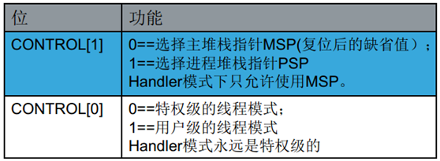

若在支持浮点单元的Cortex-M4中，CONTROL[2]用于是否启用浮点运算单元。

在CONTROL寄存器中，当第0位为1时，运行在非特权等级的程序无法切换回特权访问等级，
若有必要将处理器在线程模式切换回特权访问等级，则需要使用异常机制。
在异常处理期间，处理程序可以对该位进行操作。
若使用嵌入式OS，每次上下文切换时都可以重新编程CONTROL寄存器，一满足应用间的不同特权访问等级需要

异常/中断处理
----------------

在典型的Cortex-M系列微控制器中，NVIC接收多个中断源产生的中断请求，如下图所示

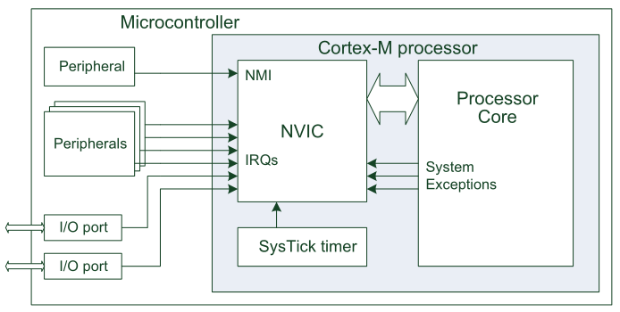

其中Cortex-M3和Cortex-M4的NVIC支持最多240个IRQ、一个不可屏蔽中断(NMI)、1个Systick定时器中断
及多个系统异常。

向量表存储着异常处理的起始地址，Cortex-M处理器会从异常向量表中自动定位异常处理的入口。
为了方便异常向量表的重定位，可通过修改
向量表偏移寄存器（VTOR）的可编程寄存器修改异常向量表的地址。

异常类型
^^^^^^^^^^^^^^^^^^

在NVIC的异常中断源中，编号为 1－15 的对应系统异常。

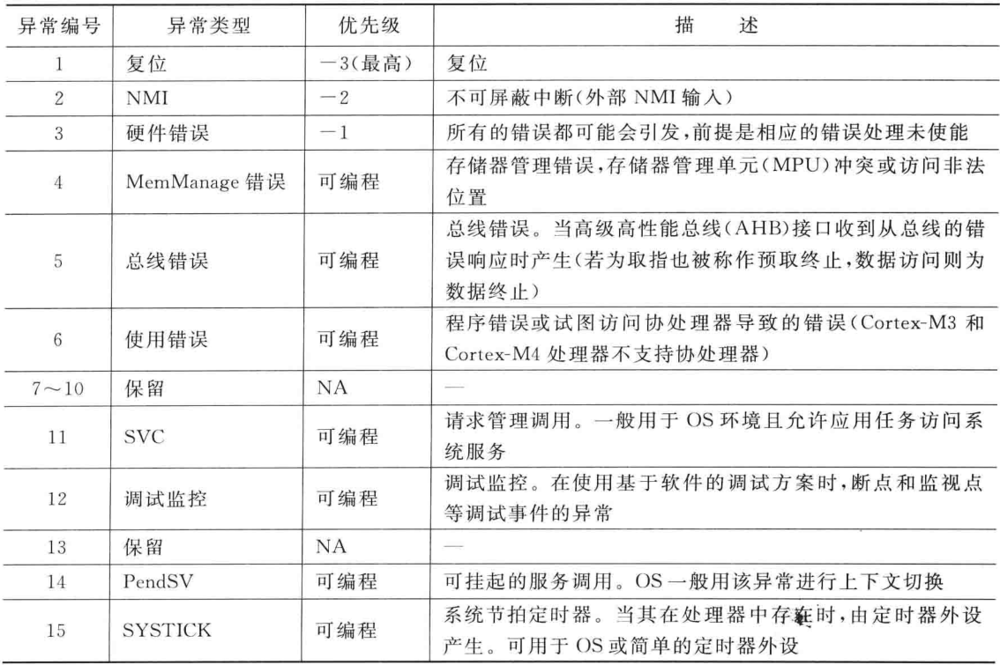

大于等于 16 的则全是外部中断。

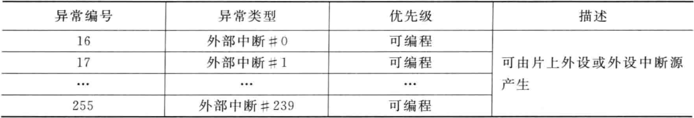

除了个别异常的优先级固定外，其它异常的优先级都是可编程的。
而对于嵌入式OS需要关注的则是复位异常和PendSV异常和Systick异常。

进入异常
^^^^^^^^^^^^

当Cortex-M3进入异常时会经历以下三个阶段

- 入栈：自动保存某些寄存器
- 取向量：从向量表中找出对应的服务程序入口地址
- 更新寄存器：选择堆栈指针MSP/PSP，更新堆栈指针SP，更新连接寄存器LR，更新程序计数器PC

入栈
""""""""""

当使用C函数作为异常处理时，异常机制会在异常入口处自动保存R0-R3、R12、LR以及PSR寄存器，
并在异常退出时将他们恢复，这些都是由处理器硬件控制的，与普通的C函数调用不同的是返回地址(PC)
并没有存储到LR中(异常机制在进入异常时将EXC_RETURN代码放入了LR中，该数值将会在异常返回时用到),
因此异常流程也需要将返回地址保存，对于Cortex-M3处理器，需要在异常处理期间保存的寄存器共有8个，
带浮点单元的Cortex-M4则需要保存更多的寄存器，在异常入口处被压入栈空间的数据块称为栈帧。如下

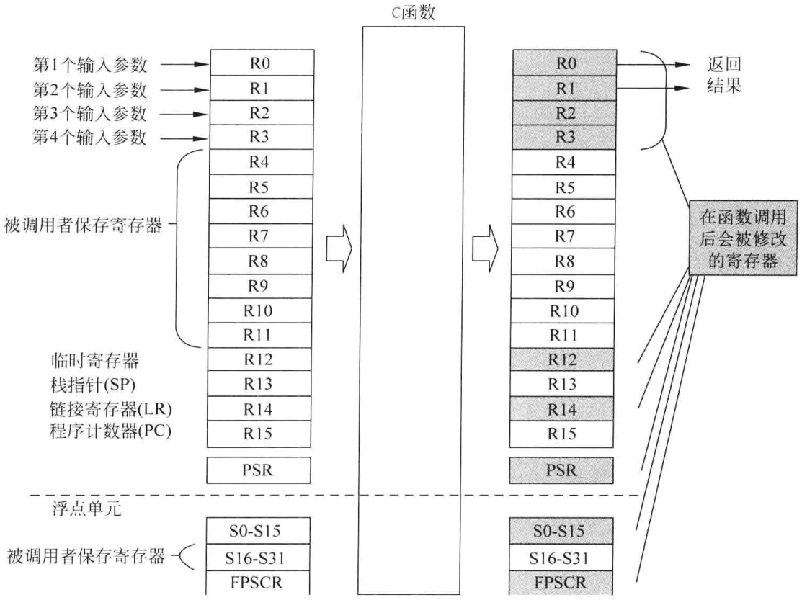

取向量
"""""""""""

从向量表中找出正确的异常向量，然后在服务程序的入口处预取指。

更新寄存器
"""""""""""""

在执行异常处理函数之前，还需要更新一系列寄存器

- SP：在入栈后会把堆栈指针（PSP或MSP）更新到新的位置。在执行服务例程时，将由MSP负责对堆栈的访问。
- PSR：更新IPSR位段（地处PSR的最低部分）的值为新响应的异常编号。
- PC：在取向量完成后，PC将指向服务例程的入口地址，
- LR：在出入ISR的时候，LR的值将得到重新的诠释，这种特殊的值称为“EXC_RETURN”，
  在异常进入时由系统计算并赋给LR，并在异常返回时使用它。

栈帧
"""""""""""""

在异常入口处被压入栈空间的数据块为栈帧，对于Cortex-M3处理器，栈帧为8字节。如下图所示

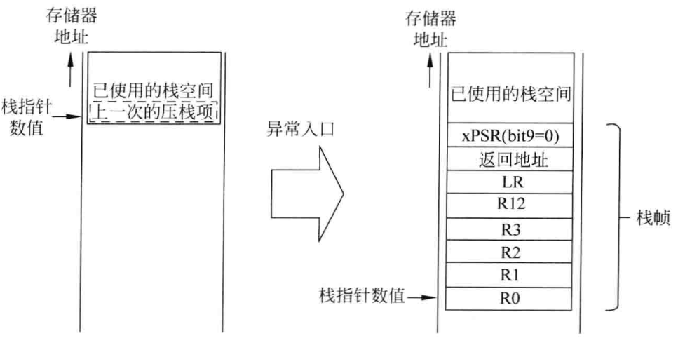

ARM结构过程调用规范（AAPCS，ARM Architecture Procedure Call Standard）要求
栈指针的数值在函数入口和出口处应该是双字节对齐的，若在中断产生时栈帧未对齐
到双字节上，Cortex-M3/M4处理器会自动插入一个字节。"双字栈对齐"特性是可编程的，
若异常未符合AAPCS，则可以将该特性关闭

.. hint:: 对于具有浮点运算单元的Cortex-M4处理器，栈帧大小可能为8字节或者26字节，了解栈帧对于RTOS操作系统很重要

异常返回   
^^^^^^^^^^^^

需要经历以下两个阶段

- 出栈：先前压入栈中的寄存器在这里恢复。
- 更新NVCI寄存器：伴随着异常的返回，活动位也被硬件清除。

在进入异常服务程序后，将自动更新LR的值为特殊的EXC_RETURN，
在异常返回时需要使用到前阶段的“EXC_RETURN”。

关于EXC_RETURN介绍如下

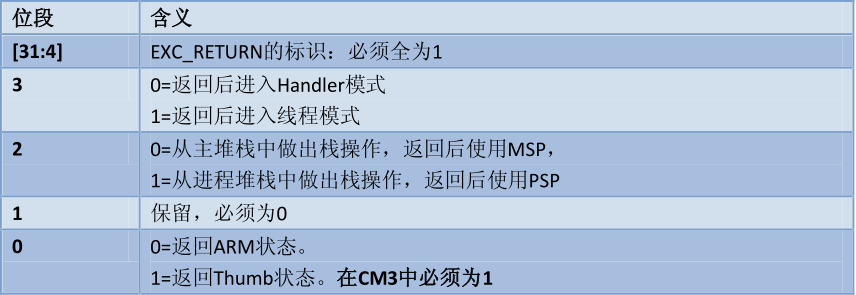

合法的EXC_RETURN值以及功能介绍如下

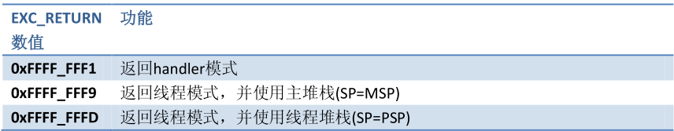

SVC异常和PendSV异常 
----------------------

SVC异常
^^^^^^^^^^^^

在许多系统(具有MPU)中，SVC机制可用于实现应用任务访问系统资源的API。
当SVC异常产生时必须立即得到相应，否则会产生硬件错误。

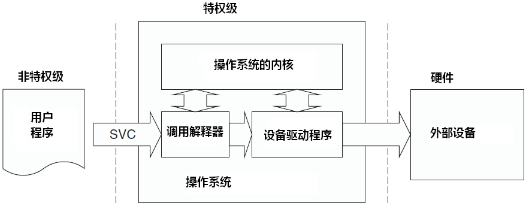

PendSV异常
^^^^^^^^^^^^^^^^^^

与SVC异常不同，PendSV异常是不精确的，它的挂起状态可在更高优先级异常处理内设置，且会在高优先级
处理完成后执行。

PendSV 的典型使用场合：在上下文切换，
PendSV异常会自动延迟上下文切换的请求，直到其它的 ISR 都完成了处理后才放行。
为实现这个机制，需要把 PendSV 编程为最低优先级的异常。
如果 OS 检测到某 IRQ 正在活动并且被 SysTick 抢占，它将悬起一个PendSV异常，
以便缓期执行上下文切换。如下图所示

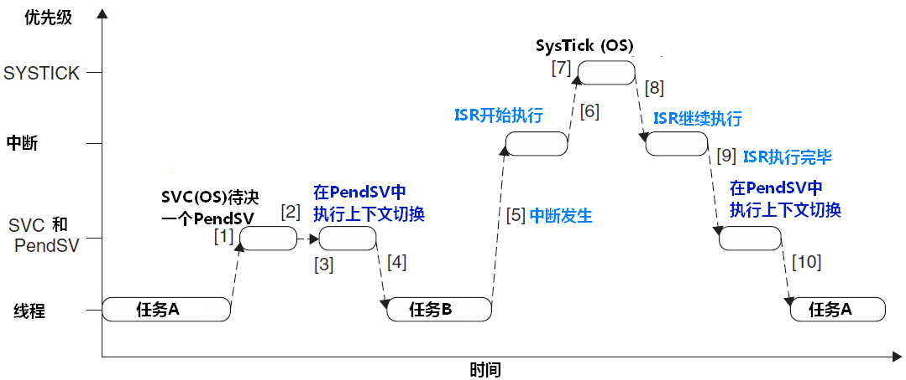

其他
-------------

存储器映射
^^^^^^^^^^^^^^^^^^

Cortex-M系列的内部存储器分布按照如下图划分设计，所有芯片厂商的存储设备均符合该设计标准

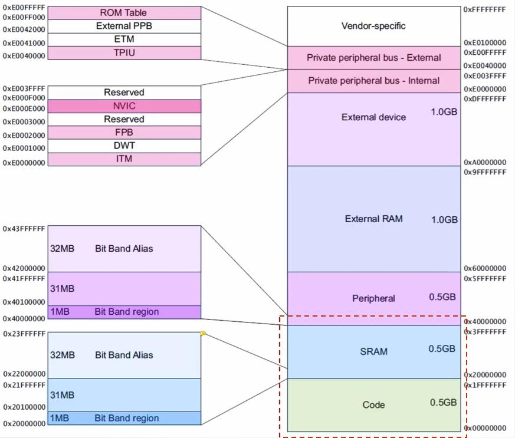

本章节内容主要对于Cortex-M3内核特性做简单介绍，详细内容可参考《ARM Cortex-M3与Cortex-M4权威指南》。

