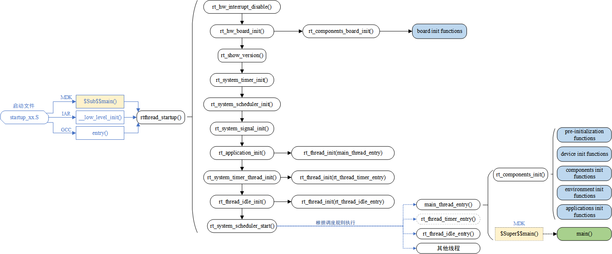

RT-thread启动
====================

rk2108平台
------------

RK2108 SDK提供的启动文件路径为： 
**/wh_rk2108/bsp/rockchip/common/hal/lib/CMSIS/Device/RK2108/Source/Templates/GCC/startup_rk2108.S**
大致内容如下

.. code-block:: S
   :caption: startup_rk2108.S
   :linenos:

   Reset_Handler:
        ......
        bl CacheInit
        ......
        bl       SystemInit
        bl       Main
        ......

- 在startup_rk2108.S中依次调用了 **CacheInit、SystemInit、Main** 相关函数，
- **Cache、SystemInit** 函数位于
  bsp/rockchip/common/hal/lib/CMSIS/Device/RK2108/Source/Templates/system_rk2108.c
- **Main** 函数位于 wh_rk2108/bsp/rockchip/rk2108/start/startup.c 中，

.. code-block:: c
   :caption: Main
   :linenos:

   int Main(void)
   {
        /* disable interrupt first */
        rt_hw_interrupt_disable();

        /* startup RT-Thread RTOS */
        rtthread_startup();

        return 0;
   }

其中rtthread_startup函数内容如下

..  code-block:: c
    :caption: rtthread_startup
    :linenos:

    void rtthread_startup(void)
    {
    #ifdef RT_USING_CMBACKTRACE
        /* init cmbacktrace */
        rt_cm_backtrace_init();
    #endif

        /* init interrupt */
        rt_hw_interrupt_init();

        /* init board */
        rt_hw_board_init();

        /* show version */
        rt_show_version();

        /* init tick */
        rt_system_tick_init();

        /* init kernel object */
        rt_system_object_init();

        /* init timer system */
        rt_system_timer_init();

    #ifdef RT_USING_HEAP
        rt_system_heap_init((void *)RK_SRAM_BEGIN, (void *)RK_SYS_HEAP_END);
    #endif

    #ifdef RT_USING_UNCACHE_HEAP
        rt_uncache_heap_init((void *)RK_UNCACHE_HEAP_START, (void *)RK_SRAM_END);
    #endif

    #ifdef RT_USING_LARGE_HEAP
        rt_large_heap_init((void *)RK_LARGE_BEGIN, (void *)RK_LARGE_END);
    #endif

        /* init scheduler system */
        rt_system_scheduler_init();

        /* init application */
        rt_application_init();

        /* init timer thread */
        rt_system_timer_thread_init();

        /* init idle thread */
        rt_thread_idle_init();

        /* start scheduler */
        rt_system_scheduler_start();

        /* never reach here */
        return;
    }

在rt_hw_board_init中初始化板级相关内容，在rt_application_init中创建用户线程相关内容。总的内容大致如下，

- 初始化与系统相关的硬件；
- 初始化系统内核对象，例如定时器、调度器、信号；
- 创建用户线程，在用户线程中对各类模块依次进行初始化；
- 初始化定时器线程、空闲线程，并启动调度器。

启动框图如下

关于各个函数具体做了哪些操作可参考如下链接：
`详细启动流程参考 <https://www.rt-thread.org/document/site/#/rt-thread-version/rt-thread-standard/programming-manual/basic/basic?id=rt-thread-%e5%90%af%e5%8a%a8%e6%b5%81%e7%a8%8b>`_

.. tip::
   rk2108的sdk工程管理相对复杂，不同的文件中均实现了相同的函数名，再查看调用关系时可查询rtthread.map文件找到相对应的文件。

RT-Thread 自动初始化机制
------------------------

在上面的流程中简单介绍了下rt-thread的启动流程，没有看到熟悉的main函数，RT-thread使用了一套自动初始化机制，
能够使得函数在不需要被显示调用，只要在函数定义处通过宏定义的方式进行声明，在系统启动过程中就会被执行。

宏定义如下

.. code-block:: c
   :caption: 自动初始化宏相关定义
   :linenos:

    #define INIT_BOARD_EXPORT(fn)           INIT_EXPORT(fn, "1")
    #define INIT_PREV_EXPORT(fn)            INIT_EXPORT(fn, "2")
    #define INIT_DEVICE_EXPORT(fn)          INIT_EXPORT(fn, "3")
    #define INIT_COMPONENT_EXPORT(fn)       INIT_EXPORT(fn, "4")
    #define INIT_ENV_EXPORT(fn)             INIT_EXPORT(fn, "5")
    #define INIT_APP_EXPORT(fn)             INIT_EXPORT(fn, "6")

..  code-block:: c
    :caption: 自动初始化举例
    :linenos:

    int clock_dev_init(void)
    {
        if (rt_mutex_init(&(clk_lock), "clkLock", RT_IPC_FLAG_FIFO) != RT_EOK)
        {
            RT_ASSERT(0);
        }
        if (rt_mutex_init(&(gate_lock), "gateLock", RT_IPC_FLAG_FIFO) != RT_EOK)
        {
            RT_ASSERT(0);
        }
        rt_slist_init(&clk_gate_list);
    #if defined(RT_USING_PMU)
        if (rt_mutex_init(&(pd_lock), "pdLock", RT_IPC_FLAG_FIFO) != RT_EOK)
        {
            RT_ASSERT(0);
        }
        rt_slist_init(&pd_list);
    #endif

        return RT_EOK;
    }
    INIT_BOARD_EXPORT(clock_dev_init);

当使用INIT_BOARD_EXPORT宏修饰clock_dev_init函数之后，在系统启动时将会自动执行clock_dev_init函数，
执行调用的函数分别为rt_components_board_init() 与 rt_components_init()。

- rt_hw_board_init->rt_components_board_init->INIT_BOARD_EXPORT修饰过的函数
- rt_application_init->创建的rt_init_thread_entry线程->rt_components_init()->除了BOARD之外，
  INIT_XXX_EXPORT修饰过的函数

自动初始化机制简单分析
^^^^^^^^^^^^^^^^^^^^^^

.. code-block:: c
   :caption: 自动初始化宏1
   :linenos:

    #define INIT_BOARD_EXPORT(fn)           INIT_EXPORT(fn, "1")
    #define INIT_PREV_EXPORT(fn)            INIT_EXPORT(fn, "2")
    #define INIT_DEVICE_EXPORT(fn)          INIT_EXPORT(fn, "3")
    #define INIT_COMPONENT_EXPORT(fn)       INIT_EXPORT(fn, "4")
    #define INIT_ENV_EXPORT(fn)             INIT_EXPORT(fn, "5")
    #define INIT_APP_EXPORT(fn)             INIT_EXPORT(fn, "6")

INIT_EXPORT宏定义如下

.. code-block:: c
   :caption: 自动初始化宏2
   :linenos:

    /*debug模式下的宏
    #define INIT_EXPORT(fn, level)                                                       \
        const char __rti_##fn##_name[] = #fn;                                            \
        RT_USED const struct rt_init_desc __rt_init_desc_##fn SECTION(".rti_fn."level) = \
        { __rti_##fn##_name, fn};
    */

    #define INIT_EXPORT(fn, level)                                                       \
        RT_USED const init_fn_t __rt_init_##fn SECTION(".rti_fn."level) = fn

完整的宏展开如下

.. code-block:: c
   :caption: 自动初始化宏3
   :linenos:

    #define RT_USED                     __attribute__((used))
    #define SECTION(x)                  __attribute__((section(x)))

    /* debug模式下的宏
    #define INIT_EXPORT(fn, level)   \
        const char __rti_##fn##_name[] = #fn;  \
        __attribute__((used)) const struct rt_init_desc __rt_init_desc_##fn \
        __attribute__((section(".rti_fn."level))) = { __rti_##fn##_name, fn};
    */
    #define INIT_EXPORT(fn, level)                                                       \
        __attribute__((used)) const init_fn_t __rt_init_##fn  __attribute__((section(".rti_fn."level))) = fn

代码实例

.. code-block:: c
   :caption: 自动初始化宏4
   :linenos:

    INIT_BOARD_EXPORT(clock_dev_init);

    /* debug模式下的宏
    const char __rti_clock_dev_init_name[] = "clock_dev_init";   
    __attribute__((used)) const struct rt_init_desc __rt_init_desc_clock_dev_init     \
    __attribute__((section(".rti_fn.""1"))) = { __rti_clock_dev_init_name, clock_dev_init};
    */
    __attribute__((used)) const init_fn_t __rt_init_clock_dev_init  __attribute__((section(".rti_fn.""1"))) = clock_dev_init

1. **__attribute__((used))** 用于通知编译器，在目标文件中保留一个静态函数或静态变量，即使没有被引用。
2. **__attribute__((section(x)))** 则是用于将数据放在特定的数据段中，这样就可以去相对应地址读取相对应数据

成功编译之后可在rtthread.map下查看到如下数据

.. code-block:: map
   :caption: rtthread.map
   :emphasize-lines: 1,10,16

                    0x00000000180ed784                __rt_init_start = .
    *(SORT_BY_NAME(.rti_fn*))
    .rti_fn.0       0x00000000180ed784        0x4 build/kernel/src/components.o
                    0x00000000180ed784                __rt_init_rti_start
    .rti_fn.0.end   0x00000000180ed788        0x4 build/kernel/src/components.o
                    0x00000000180ed788                __rt_init_rti_board_start
    .rti_fn.1       0x00000000180ed78c        0x4 build/common/drivers/drv_clock.o
                    0x00000000180ed78c                __rt_init_clock_dev_init
    .rti_fn.1.end   0x00000000180ed798        0x4 build/kernel/src/components.o
                    0x00000000180ed798                __rt_init_rti_board_end
    ......
                    0x00000000180ed82c                __rt_init_finsh_system_init
    .rti_fn.6       0x00000000180ed830        0x4 build/applications/cpw65/cpw65_main.o
                    0x00000000180ed830                __rt_init_app_cpw65_thread_init
    .rti_fn.6.end   0x00000000180ed834        0x4 build/kernel/src/components.o
                    0x00000000180ed834                __rt_init_rti_end

rt_components_board_init和 rt_components_init函数代码原型如下

.. code-block:: c
   :emphasize-lines: 15,41
   :linenos:
   

    void rt_components_board_init(void)
    {
    #if RT_DEBUG_INIT
        int result;
        const struct rt_init_desc *desc;
        for (desc = &__rt_init_desc_rti_board_start; desc < &__rt_init_desc_rti_board_start; desc ++)
        {
            rt_kprintf("initialize %s", desc->fn_name);
            result = desc->fn();
            rt_kprintf(":%d done\n", result);
        }
    #else
        const init_fn_t *fn_ptr;

        for (fn_ptr = &__rt_init_rti_board_start; fn_ptr < &__rt_init_rti_board_end; fn_ptr++)
        {
            (*fn_ptr)();
        }
    #endif
    }

    /**
    * RT-Thread Components Initialization
    */
    void rt_components_init(void)
    {
    #if RT_DEBUG_INIT
        int result;
        const struct rt_init_desc *desc;

        rt_kprintf("do components initialization.\n");
        for (desc = &__rt_init_desc_rti_board_end; desc < &__rt_init_desc_rti_end; desc ++)
        {
            rt_kprintf("initialize %s", desc->fn_name);
            result = desc->fn();
            rt_kprintf(":%d done\n", result);
        }
    #else
        const init_fn_t *fn_ptr;

        for (fn_ptr = &__rt_init_rti_board_end; fn_ptr < &__rt_init_rti_end; fn_ptr ++)
        {
            (*fn_ptr)();
        }
    #endif
    }

其他
------

.. hint:: 当使用RT-Thread Studio创建一个新的工程，其启动过程与上面类似。
   启动文件路径： **libraries/CMSIS/Device/ST/STM32F1xx/Source/Templates/gcc/startup_stm32f103xe.S** 

   执行完启动文件之后，跳转到
   **RT-ThreadStudio/workspace/RT-thread_STM32F1/rt-thread/src/components.c**
   文件执行 **rtthread_startup()函数** 完成RT-thread相关初始化

