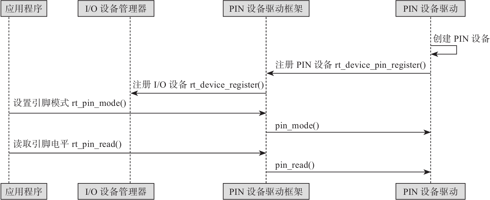
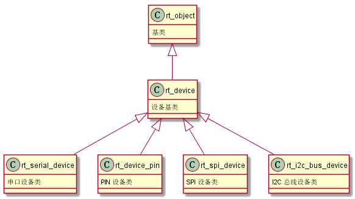
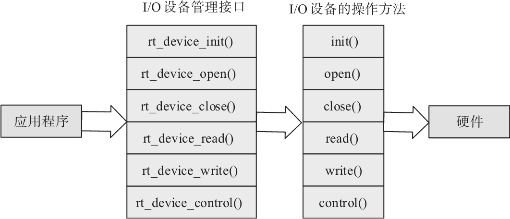

RT-thread IO设备模型
===========================

I/O 设备模型框架
------------------

RT-Thread 提供了一套 I/O 设备模型框架，位于硬件和应用程序之间，共分成三层，
分别为 I/O 设备管理层、设备驱动框架层、设备驱动层。

.. image:: media/io-dev.png
   :align: center
   :alt:  IO 设备模型框架

- I/O 设备管理层实现了对设备驱动程序的封装，应用程序通过 I/O 设备层提供的标准接口访问底层设备。
- 设备驱动框架层是对同类硬件设备驱动的抽象，将不同厂家的同类硬件设备驱动中相同的部分抽取出来，将不同部分留出接口，由驱动程序实现。
- 设备驱动层是一组驱使硬件设备工作的程序，实现访问硬件设备的功能。

应用程序通过PIN设备接口来访问PIN设备硬件，如下所示

I/O 设备模型
------------------

RT-Thread 的设备模型是建立在内核对象模型基础之上，在原来的内核对象模型基础上派生出其他的私有属性，
设备对象的继承和派生关系如下。

设备对象具体定义如下

.. code-block:: c
   :caption: 设备对象模型
   :linenos:

   struct rt_device
   {
       struct rt_object          parent;                   /**< inherit from rt_object */
   
       enum rt_device_class_type type;                     /**< device type */
       rt_uint16_t               flag;                     /**< device flag */
       rt_uint16_t               open_flag;                /**< device open flag */
   
       rt_uint8_t                ref_count;                /**< reference count */
       rt_uint8_t                device_id;                /**< 0 - 255 */
   
       /* device call back */
       rt_err_t (*rx_indicate)(rt_device_t dev, rt_size_t size);
       rt_err_t (*tx_complete)(rt_device_t dev, void *buffer);
   
   #ifdef RT_USING_DEVICE_OPS
       const struct rt_device_ops *ops;
   #else
       /* common device interface */
       rt_err_t  (*init)   (rt_device_t dev);
       rt_err_t  (*open)   (rt_device_t dev, rt_uint16_t oflag);
       rt_err_t  (*close)  (rt_device_t dev);
       rt_size_t (*read)   (rt_device_t dev, rt_off_t pos, void *buffer, rt_size_t size);
       rt_size_t (*write)  (rt_device_t dev, rt_off_t pos, const void *buffer, rt_size_t size);
       rt_err_t  (*control)(rt_device_t dev, int cmd, void *args);
   #endif
   
   #if defined(RT_USING_POSIX)
       const struct dfs_file_ops *fops;
       struct rt_wqueue wait_queue;
   #endif
   
       void                     *user_data;                /**< device private data */
   };

I/O 设备类型
------------------

其中设备类型可分为以下几种

.. code-block:: c
   :caption: 设备类型
   :linenos:

   enum rt_device_class_type
   {
       RT_Device_Class_Char = 0,                           /**< character device */
       RT_Device_Class_Block,                              /**< block device */
       RT_Device_Class_NetIf,                              /**< net interface */
       RT_Device_Class_MTD,                                /**< memory device */
       RT_Device_Class_CAN,                                /**< CAN device */
       RT_Device_Class_RTC,                                /**< RTC device */
       RT_Device_Class_Sound,                              /**< Sound device */
       RT_Device_Class_Graphic,                            /**< Graphic device */
       RT_Device_Class_I2CBUS,                             /**< I2C bus device */
       RT_Device_Class_USBDevice,                          /**< USB slave device */
       RT_Device_Class_USBHost,                            /**< USB host bus */
       RT_Device_Class_SPIBUS,                             /**< SPI bus device */
       RT_Device_Class_SPIDevice,                          /**< SPI device */
       RT_Device_Class_SDIO,                               /**< SDIO bus device */
       RT_Device_Class_PM,                                 /**< PM pseudo device */
       RT_Device_Class_Pipe,                               /**< Pipe device */
       RT_Device_Class_Portal,                             /**< Portal device */
       RT_Device_Class_Timer,                              /**< Timer device */
       RT_Device_Class_Miscellaneous,                      /**< Miscellaneous device */
       RT_Device_Class_Sensor,                             /**< Sensor device */
       RT_Device_Class_Touch,                              /**< Touch device */
       RT_Device_Class_PHY,                                /**< PHY device */
       RT_Device_Class_Unknown                             /**< unknown device */
   };

注册I/O设备   
--------------

可使用以下接口注册I/O设备。

.. code-block:: c
   :caption: 注册I/O设备接口
   :linenos:

   //创建、销毁
   rt_device_t rt_device_create(int type, int attach_size);
   void rt_device_destroy(rt_device_t device);

   //注册
   rt_err_t rt_device_register(rt_device_t dev, const char* name, rt_uint8_t flags);

其中rt_device_register函数flags 参数支持下列参数 (可以采用或的方式支持多种参数)：

.. code-block:: c
   :caption: flags 参数
   :linenos:

   #define RT_DEVICE_FLAG_RDONLY           0x001           /**< read only */
   #define RT_DEVICE_FLAG_WRONLY           0x002           /**< write only */
   #define RT_DEVICE_FLAG_RDWR             0x003           /**< read and write */
   
   #define RT_DEVICE_FLAG_REMOVABLE        0x004           /**< removable device */
   #define RT_DEVICE_FLAG_STANDALONE       0x008           /**< standalone device */
   #define RT_DEVICE_FLAG_ACTIVATED        0x010           /**< device is activated */
   #define RT_DEVICE_FLAG_SUSPENDED        0x020           /**< device is suspended */
   #define RT_DEVICE_FLAG_STREAM           0x040           /**< stream mode */
   
   #define RT_DEVICE_FLAG_INT_RX           0x100           /**< INT mode on Rx */
   #define RT_DEVICE_FLAG_DMA_RX           0x200           /**< DMA mode on Rx */
   #define RT_DEVICE_FLAG_INT_TX           0x400           /**< INT mode on Tx */
   #define RT_DEVICE_FLAG_DMA_TX           0x800           /**< DMA mode on Tx */
   

访问I/O设备 
-------------

应用程序通过I/O设备管理接口来访问硬件设备，当设备驱动实现后，应用程序就可以访问该硬件。
I/O设备管理接口与I/O设备的操作方法的映射关系如下

.. code-block:: c
   :caption: 访问I/O设备接口
   :linenos:

   rt_device_t rt_device_find(const char* name);
   rt_err_t rt_device_init(rt_device_t dev);
   rt_err_t rt_device_open(rt_device_t dev, rt_uint16_t oflags);
   rt_err_t rt_device_close(rt_device_t dev);
   rt_err_t rt_device_control(rt_device_t dev, rt_uint8_t cmd, void* arg);
   rt_size_t rt_device_read(rt_device_t dev, rt_off_t pos, void* buffer, rt_size_t size);
   rt_size_t rt_device_write(rt_device_t dev, rt_off_t pos, const void* buffer, rt_size_t size);

   rt_err_t rt_device_set_rx_indicate(rt_device_t dev,
                                       rt_err_t (*rx_ind)(rt_device_t dev, rt_size_t size))

   rt_err_t rt_device_set_tx_complete(rt_device_t dev,
                                      rt_err_t (*tx_done)(rt_device_t dev, void *buffer))

当使用rt_device_open函数时，oflags支持以下参数

.. code-block:: c
   :caption: rt_device_open oflags参数
   :linenos:

   #define RT_DEVICE_FLAG_DEACTIVATE       0x000           /**< device is not not initialized */

   #define RT_DEVICE_FLAG_RDONLY           0x001           /**< read only */
   #define RT_DEVICE_FLAG_WRONLY           0x002           /**< write only */
   #define RT_DEVICE_FLAG_RDWR             0x003           /**< read and write */

   #define RT_DEVICE_FLAG_REMOVABLE        0x004           /**< removable device */
   #define RT_DEVICE_FLAG_STANDALONE       0x008           /**< standalone device */
   #define RT_DEVICE_FLAG_ACTIVATED        0x010           /**< device is activated */
   #define RT_DEVICE_FLAG_SUSPENDED        0x020           /**< device is suspended */
   #define RT_DEVICE_FLAG_STREAM           0x040           /**< stream mode */

   #define RT_DEVICE_FLAG_INT_RX           0x100           /**< INT mode on Rx */
   #define RT_DEVICE_FLAG_DMA_RX           0x200           /**< DMA mode on Rx */
   #define RT_DEVICE_FLAG_INT_TX           0x400           /**< INT mode on Tx */
   #define RT_DEVICE_FLAG_DMA_TX           0x800           /**< DMA mode on Tx */

.. hint:: 如果上层应用程序需要设置设备的接收回调函数，
   则必须以RT_DEVICE_FLAG_INT_RX或者RT_DEVICE_FLAG_DMA_RX的方式打开设备，否则不会回调函数。

当使用rt_device_control函数时，在rtdef.h中定义的cmd命令有如下几种，用户也可自行添加自己的cmd

.. code-block:: c
   :caption: rt_device_control cmd命令
   :linenos:

   /**
   * general device commands
   */
   #define RT_DEVICE_CTRL_RESUME           0x01            /**< resume device */
   #define RT_DEVICE_CTRL_SUSPEND          0x02            /**< suspend device */
   #define RT_DEVICE_CTRL_CONFIG           0x03            /**< configure device */
   #define RT_DEVICE_CTRL_CLOSE            0x04            /**< close device */
   
   #define RT_DEVICE_CTRL_SET_INT          0x10            /**< set interrupt */
   #define RT_DEVICE_CTRL_CLR_INT          0x11            /**< clear interrupt */
   #define RT_DEVICE_CTRL_GET_INT          0x12            /**< get interrupt status */
   
   /**
   * special device commands
   */
   #define RT_DEVICE_CTRL_CHAR_STREAM      0x10            /**< stream mode on char device */
   #define RT_DEVICE_CTRL_BLK_GETGEOME     0x10            /**< get geometry information   */
   #define RT_DEVICE_CTRL_BLK_SYNC         0x11            /**< flush data to block device */
   #define RT_DEVICE_CTRL_BLK_ERASE        0x12            /**< erase block on block device */
   #define RT_DEVICE_CTRL_BLK_AUTOREFRESH  0x13            /**< block device : enter/exit auto refresh mode */
   #define RT_DEVICE_CTRL_NETIF_GETMAC     0x10            /**< get mac address */
   #define RT_DEVICE_CTRL_MTD_FORMAT       0x10            /**< format a MTD device */
   #define RT_DEVICE_CTRL_RTC_GET_TIME     0x10            /**< get time */
   #define RT_DEVICE_CTRL_RTC_SET_TIME     0x11            /**< set time */
   #define RT_DEVICE_CTRL_RTC_GET_ALARM    0x12            /**< get alarm */
   #define RT_DEVICE_CTRL_RTC_SET_ALARM    0x13            /**< set alarm */

   
参考链接
-------------

I/O设备模型：https://www.rt-thread.org/document/site/#/rt-thread-version/rt-thread-standard/programming-manual/device/device
