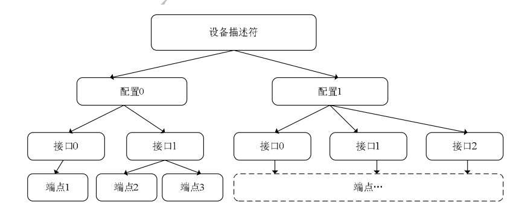

USB基础
===========

基本概念
--------

usb1.0 usb1.1

- 低速 low-speed 1.5Mb/s
- 全速 full-speed 12Mb/s

usb2.0

- 高速 high-speed 480Mb/s

层级关系
~~~~~~~~~

- 1.设备描述符，协议版本号、设备类型、端点0的最大包大小、厂商ID(VID)和产品ID(PID)、设备版本号等等

- 2.配置描述符，接口数、配置的编号、供电方式等

- 3.接口描述符，接口的编号、接口的端点数、接口所使用的类、子类、协议等

- 4.端点描述符，端点号及方端点的传输类型、最大包长度、查询时间间隔

- ​5.字符串描述符，方便人们阅读的信息（非必须）

SB协议规定了四种传输类型：控制传输、
\ `批量传输 <http://www.usbzh.com/article/detail-40.html>`__\ 、
\ `同步传输 <http://www.usbzh.com/article/detail-118.html>`__\ 、
\ `中断传输 <http://www.usbzh.com/article/detail-109.html>`__\ 。

传输模式
~~~~~~~~~~~

控制传输：
- 1.建立过程 ,由usb主机发起始于SETUP令牌包，紧跟DATA0数据包
- 2.数据过程(可选)
- 3.状态过程，用于确认所有的数据是否正确传输完成

枚举过程：

- 1.检测到usb插入时对设备进行复位，获取设备描述符(仅需前8字节)
- 2.主机对设备进行又一次复位，进入地址设置阶段
- 3.使用新地址再次获取设备描述符（18字节）
- 4.主机获取配置描述符(9字节)
  - a.配置描述符
  - b.接口描述符
  - c.特殊类描述符
  - d.端点描述符

- 5.字符描述符

USb的包结构和包的分类
~~~~~~~~~~~~~~~~~~~~~~~

- 传输方式：LSB在前，NRZI编码
- 在usb系统中，主机处于主导地位，设备到主机的数据为输入，主机到设备的数据为输出
- USB总线传输数据以包为基本单位，一个包被分成不同的域，根据不同类型的包，所包含的域也不一样。
- 同步域—包标识符PID—……—包结束符EOP
- 包标识符—8位，USB协议使用到的只有4位，另外4位用于校验PID
- 令牌包(01)、数据包(11)、握手包()10、特殊包(00)

======= ======= === ====================
PID类型 PID名   PID 说明
======= ======= === ====================
令牌类  OUT         通知设备将于输出数据
\       IN          通知设备将于输入数据
\       SOF         帧起始包
\       SETUP       将要开始一个控制传输
数据类  DATA0       
\       DATA1       
\       DATA2\*     
\       MDATA\*     
握手类  ACK         确认
\       NAK         不确认
\       STALL       挂起
\       NYET\*      未准备好
特殊类  PRE         前导(令牌包)
\       ERR\*       错误(握手包)
\       SPLIT\*     分裂事物(令牌包)
\       PING\*      PING测试(令牌包)
======= ======= === ====================

每个usb设置至少都有一个配置描述符，在设备描述符中规定了该设备有多少种设备配置。

当某个描述符中的字符串索引值为非0时，表示具有那个字符串描述符，索引值不能重复。

当索引值为0时表示获取语言ID，字符串描述符中的bString使用UNICODE编码

描述符
------

-  每一个USB设备只有一个\ `设备描述符 <http://www.usbzh.com/article/detail-104.html>`__\ ，
   主要向主机说明设备类型、端点0最大包长、设备版本、配置数量等等。

-  每一个USB设备至少有一个或者多个
   \ `配置描述符 <http://www.usbzh.com/article/detail-67.html>`__\ ，
   但是主机同一时间只能选择某一种配置，标准
   \ `配置描述符 <http://www.usbzh.com/article/detail-67.html>`__\ 
   主要向主机描述当前配置下的设备属性、所需电流、支持的接口数、
   \ `配置描述符 <http://www.usbzh.com/article/detail-67.html>`__\ 集合长度等等。

-  主机在获取配置描述符集合的时候会先获取一次标准配置描述符，
   然后根据里面的配置描述符集合长度属性值获取配置描述符集合的所有描述符信息，配置描述符集合有标准配置描述符、
   \ `接口描述符 <http://www.usbzh.com/article/detail-64.html>`__\ 、
   \ `端点描述符 <http://www.usbzh.com/article/detail-56.html>`__\ 、
   \ `HID描述符 <http://www.usbzh.com/article/detail-62.html>`__\ 。

-  每一个USB配置下至少有一个或者多个\ `接口描述符 <http://www.usbzh.com/article/detail-64.html>`__\ ，
   \ `接口描述符 <http://www.usbzh.com/article/detail-64.html>`__\ 主要说明设备类型、
   此接口下使用的端点数（不包括0号号端点），一个接口就是实现一种功能，实现这种功能可能需要端点0就够了，
   可能还需要其它的端点配合。

-  每一个USB接口下至少有0个或者多个\ `端点描述符 <http://www.usbzh.com/article/detail-56.html>`__\ ，
   \ `端点描述符 <http://www.usbzh.com/article/detail-56.html>`__\ 用来描述符端点的各种属性。

-  端点是实现USB设备功能的物理缓冲区实体，USB主机和设备是通过端点进行数据交互的。
  
-  一个USB设备有一个或多个配置描述符。每个配置有一个或多个接口，每个接口有零个或多个端点。
  
-  `字符串描述符 <http://www.usbzh.com/article/detail-53.html>`__\ 就是用字符串描述一个设备的一些属性，
    描述的属性包括设备厂商名字、产品名字、产品序列号、各个配置名字、各个接口名字。

-  `HID描述符 <http://www.usbzh.com/article/detail-62.html>`__\ 只有HID设备才会存在。
  
-  HID设备至少有一个\ `报告描述符 <http://www.usbzh.com/article/detail-48.html>`__\ 。
  
-  `报告描述符 <http://www.usbzh.com/article/detail-48.html>`__\ 主要作用就是描述主机和HID设备交互的数据，
   向主机说明这些数据中哪些位是用来做什么用的

   USB逻辑图

+----------------------------+----------------------------+----------+
| 描述符                     | 应用                       | 数值类型 |
+============================+============================+==========+
| `设备描述                  | 所有设备必须有，只能一个   | 1        |
| 符 <http://www.usbzh.com/a |                            |          |
| rticle/detail-104.html>`__ |                            |          |
+----------------------------+----------------------------+----------+
| 配置描述符                 | 所有设备必须有，至少一个   | 2        |
+----------------------------+----------------------------+----------+
| `字符串描述                | 可选择                     | 3        |
| 符 <http://www.usbzh.com/  |                            |          |
| article/detail-53.html>`__ |                            |          |
+----------------------------+----------------------------+----------+
| `接口描述                  | 每一个接口一个             | 4        |
| 符 <http://www.usbzh.com/  |                            |          |
| article/detail-64.html>`__ |                            |          |
+----------------------------+----------------------------+----------+
| `端点描述                  | 除端点0之外的每个端点一个  | 5        |
| 符 <http://www.usbzh.com/  |                            |          |
| article/detail-56.html>`__ |                            |          |
+----------------------------+----------------------------+----------+
| `设备限定描述              | 同时支持                   | 6        |
| 符 <http://www.usbzh.com/  | 全速与高速的设备必须有一个 |          |
| article/detail-50.html>`__ |                            |          |
| Device_Qualiffier          |                            |          |
+----------------------------+----------------------------+----------+
| `其它速率配置描述          |                            | 7        |
| 符 <http://www.usbzh.com/  |                            |          |
| article/detail-88.html>`__ |                            |          |
| Other_Speed_Configuration  |                            |          |
+----------------------------+----------------------------+----------+
| Interface_power            |                            | 8        |
+----------------------------+----------------------------+----------+
| HID描述符                  | HID设备必须有              | 21       |
+----------------------------+----------------------------+----------+
| Hub描述符                  |                            | 29       |
+----------------------------+----------------------------+----------+
| 报表描述符                 | HID设备必须有              | 22       |
+----------------------------+----------------------------+----------+
|                            |                            |          |
+----------------------------+----------------------------+----------+
| 实体描述符 Physical        | 可选择的                   | 23       |
+----------------------------+----------------------------+----------+

设备描述符
~~~~~~~~~~

.. code:: c

   struct udevice_descriptor
   {
       uint8_t bLength;            //设备描述符的字节数大小，为0x12 
       uint8_t type;               //描述符类型编号，为0x01 
       uint16_t bcdUSB;            //USB版本号    
       uint8_t bDeviceClass;       //USB分配的设备类代码，0x01~0xfe为标准设备类，0xff为厂商自定义类型 
                                   //0x00不是在设备描述符中定义的，如HID 
       uint8_t bDeviceSubClass;    //usb分配的子类代码，同上，值由USB规定和分配的 
       uint8_t bDeviceProtocol;    //USB分配的设备协议代码，同上 
       uint8_t bMaxPacketSize0;    //端点0的最大包的大小 
       uint16_t idVendor;          //厂商编号 
       uint16_t idProduct;         //产品编号 
       uint16_t bcdDevice;         //设备出厂编号 
       uint8_t iManufacturer;      //描述厂商字符串的索引 
       uint8_t iProduct;           //描述产品字符串的索引 
       uint8_t iSerialNumber;      //描述设备序列号字符串的索引 
       uint8_t bNumConfigurations; //配置描述符数量
   };

配置描述符
~~~~~~~~~~

.. code:: c

   struct uconfig_descriptor
   {
       uint8_t bLength;                //配置描述符的字节数大小，为0x09 
       uint8_t type;                   //描述符类型编号，为0x02 
       uint16_t wTotalLength;          //此配置信息的总长（包括接口，端点和设备类及厂商定义的描述符）
       uint8_t bNumInterfaces;         //此配置所支持的接口数量 
       uint8_t bConfigurationValue;    //Set_Configuration命令需要的参数值 
       uint8_t iConfiguration;         //描述该配置的字符串的索引值 
       uint8_t bmAttributes;           //供电模式的选择 
       uint8_t MaxPower;               //设备从总线提取的最大电流 
       //uint8_t data[2048];
   };

接口描述符
~~~~~~~~~~

.. code:: c

   struct uinterface_descriptor
   {
       uint8_t bLength;                //设备描述符的字节数大小，为0x09
       uint8_t type;                   //描述符类型编号，为0x04
       uint8_t bInterfaceNumber;       //接口的编号 
       uint8_t bAlternateSetting;      //备用的接口描述符编号
       uint8_t bNumEndpoints;          //该接口使用端点数，不包括端点0
       uint8_t bInterfaceClass;        //接口类型 
       uint8_t bInterfaceSubClass;     //接口子类型 
       uint8_t bInterfaceProtocol;     //接口所遵循的协议
       uint8_t iInterface;             //描述该接口的字符串索引值 
   };

端点描述符
~~~~~~~~~~

.. code:: c

   struct uendpoint_descriptor
   {
       uint8_t  bLength;               //描述符大小．固定为0x07
       uint8_t  type;                  //描述符类型编号，为0x05
       uint8_t  bEndpointAddress;      //端点地址及输入输出属性
       uint8_t  bmAttributes;          //端点的传输类型属性 
       uint16_t wMaxPacketSize;        //端点收、发的最大包的大小 
       uint8_t  bInterval;             //主机查询端点的时间间隔 
   };

字符串描述符
~~~~~~~~~~~~

.. code:: c

   struct ustring_descriptor
   {
       uint8_t bLength;        //描述符大小
       uint8_t type;           //接口描述符类型，固定为0x03
       uint8_t String[1];      //Unicode编码字符串
       //uint8_t String[64];   
   };

当设置索引为0时，USB设备语言ID

usb标准请求
-----------

USB定义了8个字节的标准请求，通过这些请求，可以对设备的状态进行更改或对设备进行枚举。
USB的标准请求的数据传输方式都是\ `控制传输 <http://www.usbzh.com/article/detail-55.html>`__\ 方式，所以使用的端点是设备的默认端点0。

数据结构如下

================ ============= =========== =========== ============
1字节            1字节         2字节       2字节       2字节
================ ============= =========== =========== ============
bmRequestType(1) bRequest（1） wValue（2） wIndex（2） wLength（2）
================ ============= =========== =========== ============

USB标准请求类型如下

+----------+----------+----------+----------+----------+----------+
| bmReques | bRe      | w        | w        | wL       | 数据过程 |
| tType(1) | quest(1) | Value(2) | Index(2) | ength(2) |          |
+==========+==========+==========+==========+==========+==========+
| 0x00     | `CLE     | 特性选择 | 0        | 0        | 没有数据 |
|          | AR_FEATU |          |          |          |          |
|          | RE <http |          |          |          |          |
|          | ://www.u |          |          |          |          |
|          | sbzh.com |          |          |          |          |
|          | /article |          |          |          |          |
|          | /detail- |          |          |          |          |
|          | 89.html> |          |          |          |          |
|          | `__\ (1) |          |          |          |          |
+----------+----------+----------+----------+----------+----------+
| 0x01     | `CLE     | 特性选择 | 接口号   | 0        | 没有数据 |
|          | AR_FEATU |          |          |          |          |
|          | RE <http |          |          |          |          |
|          | ://www.u |          |          |          |          |
|          | sbzh.com |          |          |          |          |
|          | /article |          |          |          |          |
|          | /detail- |          |          |          |          |
|          | 89.html> |          |          |          |          |
|          | `__\ (1) |          |          |          |          |
+----------+----------+----------+----------+----------+----------+
| 0x02     | CLEAR_FE | 特性选择 | 端点号   | 0        | 没有数据 |
|          | ATURE(1) |          |          |          |          |
+----------+----------+----------+----------+----------+----------+
| 0x80     | `GET_CON | 0        | 0        | 1        | 配置制   |
|          | FIGURATI |          |          |          |          |
|          | ON <http |          |          |          |          |
|          | ://www.u |          |          |          |          |
|          | sbzh.com |          |          |          |          |
|          | /article |          |          |          |          |
|          | /detail- |          |          |          |          |
|          | 49.html> |          |          |          |          |
|          | `__\ (8) |          |          |          |          |
+----------+----------+----------+----------+----------+----------+
| 0x80     | G        | 描       | 0        | 描述     | 描述符   |
|          | ET_DESCR | 述符类型 | 或语言ID | 符的长度 |          |
|          | IPTOR(6) | （高字节 | (`字符串 |          |          |
|          |          | ）和描述 | 描述符 < |          |          |
|          |          | 符索引（ | http://w |          |          |
|          |          | 低字节） | ww.usbzh |          |          |
|          |          |          | .com/art |          |          |
|          |          |          | icle/det |          |          |
|          |          |          | ail-53.h |          |          |
|          |          |          | tml>`__) |          |          |
+----------+----------+----------+----------+----------+----------+
| 0x81     | `GET_IN  | 0        | 接口号   | 1        | 备用（转 |
|          | TERFACE  |          |          |          | 换）接口 |
|          | <http:// |          |          |          |          |
|          | www.usbz |          |          |          |          |
|          | h.com/ar |          |          |          |          |
|          | ticle/de |          |          |          |          |
|          | tail-54. |          |          |          |          |
|          | html>`__ |          |          |          |          |
|          | \ (0x0a) |          |          |          |          |
+----------+----------+----------+----------+----------+----------+
| 0x80     | `        | 0        | 0        | 2        | 设备状态 |
|          | GET_STAT |          |          |          |          |
|          | US <http |          |          |          |          |
|          | ://www.u |          |          |          |          |
|          | sbzh.com |          |          |          |          |
|          | /article |          |          |          |          |
|          | /detail- |          |          |          |          |
|          | 38.html> |          |          |          |          |
|          | `__\ (0) |          |          |          |          |
+----------+----------+----------+----------+----------+----------+
| 0x81     | `        | 0        | 接口号   | 2        | 接口状态 |
|          | GET_STAT |          |          |          |          |
|          | US <http |          |          |          |          |
|          | ://www.u |          |          |          |          |
|          | sbzh.com |          |          |          |          |
|          | /article |          |          |          |          |
|          | /detail- |          |          |          |          |
|          | 38.html> |          |          |          |          |
|          | `__\ (0) |          |          |          |          |
+----------+----------+----------+----------+----------+----------+
| 0x82     | GET_S    | 0        | 端点号   | 2        | 端点状态 |
|          | TATUS(0) |          |          |          |          |
+----------+----------+----------+----------+----------+----------+
| 0x00     | `SE      | 设备地址 | 0        | 0        | 没有数据 |
|          | T_ADDRES |          |          |          |          |
|          | S <http: |          |          |          |          |
|          | //www.us |          |          |          |          |
|          | bzh.com/ |          |          |          |          |
|          | article/ |          |          |          |          |
|          | detail-1 |          |          |          |          |
|          | 12.html> |          |          |          |          |
|          | `__\ (5) |          |          |          |          |
+----------+----------+----------+----------+----------+----------+
| 0x00     | `SET_CON | 配置值   | 0        | 0        | 没有数据 |
|          | FIGURATI |          |          |          |          |
|          | ON <http |          |          |          |          |
|          | ://www.u |          |          |          |          |
|          | sbzh.com |          |          |          |          |
|          | /article |          |          |          |          |
|          | /detail- |          |          |          |          |
|          | 75.html> |          |          |          |          |
|          | `__\ (9) |          |          |          |          |
+----------+----------+----------+----------+----------+----------+
| 0x00     | `SET_D   | 描       | 0        | 描述     | 描述符   |
|          | ESCRIPTO | 述符类型 | 或语言ID | 符的长度 |          |
|          | R <http: | （高字节 | (`字符串 |          |          |
|          | //www.us | ）和描述 | 描述符 < |          |          |
|          | bzh.com/ | 符索引（ | http://w |          |          |
|          | article/ | 低字节） | ww.usbzh |          |          |
|          | detail-1 |          | .com/art |          |          |
|          | 14.html> |          | icle/det |          |          |
|          | `__\ (7) |          | ail-53.h |          |          |
|          |          |          | tml>`__) |          |          |
+----------+----------+----------+----------+----------+----------+
| 0x00     | `S       | 特性选择 | 0        | 0        | 没有数据 |
|          | ET_FEATU |          |          |          |          |
|          | RE <http |          |          |          |          |
|          | ://www.u |          |          |          |          |
|          | sbzh.com |          |          |          |          |
|          | /article |          |          |          |          |
|          | /detail- |          |          |          |          |
|          | 24.html> |          |          |          |          |
|          | `__\ (3) |          |          |          |          |
+----------+----------+----------+----------+----------+----------+
| 0x01     | `S       | 特性选择 | 接口号   | 0        | 没有数据 |
|          | ET_FEATU |          |          |          |          |
|          | RE <http |          |          |          |          |
|          | ://www.u |          |          |          |          |
|          | sbzh.com |          |          |          |          |
|          | /article |          |          |          |          |
|          | /detail- |          |          |          |          |
|          | 24.html> |          |          |          |          |
|          | `__\ (3) |          |          |          |          |
+----------+----------+----------+----------+----------+----------+
| 0x02     | SET_FE   | 特性选择 | 端点号   | 0        | 没有数据 |
|          | ATURE(3) |          |          |          |          |
+----------+----------+----------+----------+----------+----------+
| 0x01     | `SET_IN  | 备用接口 | 接口号   | 0        | 没有数据 |
|          | TERFACE  | 号（转换 |          |          |          |
|          | <http:// | 接口号） |          |          |          |
|          | www.usbz |          |          |          |          |
|          | h.com/ar |          |          |          |          |
|          | ticle/de |          |          |          |          |
|          | tail-28. |          |          |          |          |
|          | html>`__ |          |          |          |          |
|          | \ (0x0b) |          |          |          |          |
+----------+----------+----------+----------+----------+----------+
| 0x82     | `SYNC    | 0        | 端点号   | 2        | 帧号     |
|          | H_FRAME  |          |          |          |          |
|          | <http:// |          |          |          |          |
|          | www.usbz |          |          |          |          |
|          | h.com/ar |          |          |          |          |
|          | ticle/de |          |          |          |          |
|          | tail-44. |          |          |          |          |
|          | html>`__ |          |          |          |          |
|          | \ (0x0c) |          |          |          |          |
+----------+----------+----------+----------+----------+----------+

常见的标准请求如下

1. GET_DESCRIPTOR （获取描述符） 
   全速和低速模式下只有：

   - 获取设备描述符 
   - 获取配置描述符
   - 获取字符串描述符
  
   接口描述符和端点描述符跟随配置描述符一起返回

#. SET_ADDRESS (请求设备使用指定地址地址)
#. SET_CONFIGURATION (设置配置)

参考
----

`USB中文网 <http://www.usbzh.com/article/detail-177.html>`__
