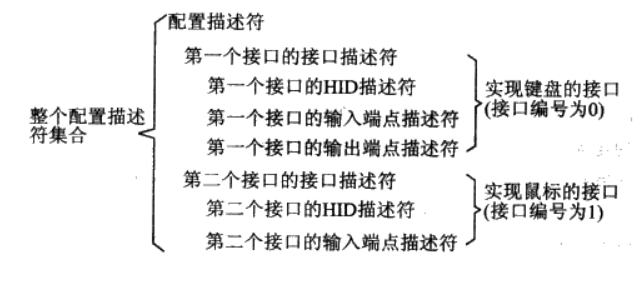

### USB

枚举过程：

​	1.检测到usb插入时对设备进行复位，获取设备描述符(仅需前8字节)

​	2.主机对设备进行又一次复位，进入地址设置阶段

​	3.使用新地址再次获取设备描述符（18字节）

​	4.主机获取配置描述符(9字节)

​				a.配置描述符

​				b.接口描述符

​				c.特殊类描述符

​				d.端点描述符

   5.字符描述符(可选)

#### HID设备

代码流程相关

​	1.板子上led、key、uart相关外设初始化

​	2.usb相关功能函数

​				a.usb的断开与连接

​				b.usb中断的处理

​				c.读取从主机发送到端点的数据

​				d.将数据填充到端点发送缓冲区

​				e.根据不同的请求返回不同描述符

​				f.设置地址请求接口

​				g.根据不同字符串索引返回不同的字符串描述符

​	3.设备描述符的实现，并通过接口将设备描述符返回给主机

​	4.设置地址请求的处理

​	5.配置描述符、接口描述符、类特殊描述符、端点描述符大集合的实现

​				a.配置描述符的实现

​				b.接口描述符的实现

​				c.若是HID设备，还需HID描述符的实现

​						①HID的下级描述符类型可分为：报告描述符、物理描述符

​						②HID包含下级描述符的个数及大小信息

​				d.端点描述符的实现

​	6.字符串描述符及语言ID请求的实现

​	7.设置配置请求的实现，根据所请求的配置值，使能相对应的端点

​	8.报告描述符的实现

​	9.报告的返回

报告描述符分为输入报告、输出报告，用于描述一个报告的结构以及该报告里面的数据的作用，由条目组成。

HID设备类一般配置数据传输端点为中断传输，由于USB不支持硬件中断，所以USB的中断传输实际上是主机在一定的时间内不断地轮询设备检查其是否有数据需要传输，有3个重要参数需要在端点描述符中进行配置：

-   传输类型
-   轮询时间间隔
-   每次传输的最大数据包大小

#### 复合HID设备

使用单个接口，使用多个报告描述符

使用多个接口，每个接口实现一个HID设备

