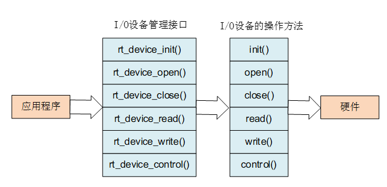

Keypad设备
================================

基于rtthread的rk2108 Keypad相关驱动开发与记录。

设计概要
----------------

功能需求
^^^^^^^^^^^^^^

1. 实现按键短按功能。
2. 实现按键长按功能。
3. 能够方便修改按键的长/短按时间。
4. 能够添加不同按键事件上报。

设计原则
^^^^^^^^^^^^^^

1. 模块化，减少代码耦合
2. 兼容性，能保证不同模块可复用相似借口，避免代码冗余
3. 层次分明，逻辑/数据层划分要清晰
4. 实现多平台代码复用

软件设计
----------------

RT-thread设备驱动模型
^^^^^^^^^^^^^^^^^^^^^^^

RT-Thread 提供了一套 I/O 设备模型框架，位于硬件和应用程序之间，共分成三层，
分别为 I/O 设备管理层、设备驱动框架层、设备驱动层。

.. image:: media/io-dev.png
   :align: center
   :alt:  IO 设备模型框架

- I/O 设备管理层实现了对设备驱动程序的封装，应用程序通过 I/O 设备层提供的标准接口访问底层设备。
- 设备驱动框架层是对同类硬件设备驱动的抽象，将不同厂家的同类硬件设备驱动中相同的部分抽取出来，
  将不同部分留出接口，由驱动程序实现。
- 设备驱动层是一组驱使硬件设备工作的程序，实现访问硬件设备的功能。

访问I/O设备
^^^^^^^^^^^^^^^

应用程序通过I/O设备管理接口来访问硬件设备，当设备驱动实现后，应用程序就可以访问该硬件。
I/O设备管理接口与I/O设备的操作方法的映射关系如下

LED设备驱动实现
^^^^^^^^^^^^^^^^^^^^^

程序实现步骤
""""""""""""""

1. 实现rt_iokey_init、rt_iokey_read及rt_iokey_control函数
2. 注册iokey设备
3. 通过rt_device_find找到相关设备
4. 调用rt_device_init初始化设备，会自动创建一个定时器对按键状态进行监测。
5. 使用rt_device_control设置keypad GPIO引脚等。
6. 使用rt_device_set_rx_indicate设置数据收发回调

.. hint::
   当硬件设备收到数据时，可以通过rt_device_set_tx_complete函数设置另一个函数回调来设置数据接收指示，
   通知上层应用线程有数据到达。

.. hint:: 虽然没有实现open函数，但想要使用rt_device_read函数，仍然需要先使用rt_device_open
   先打开对应设备。

rt_device_control控制命令
"""""""""""""""""""""""""""""

keypad设备的控制命令较为简单，主要为设置按键所在的GPIO引脚。

.. code-block:: c
   :caption: keypad cmd
   :linenos:

   #define RT_IOKEY_CTRL_GET_INFO                     (1)
   #define RT_IOKEY_CTRL_SET_GPIO                     (2)

按键事件
""""""""""""""

默认现有的keypad状态有以下两种，分别为长按事件和短按事件，当有其他的应用场景时，可再添加其他模式。

.. code-block:: c
   :caption: flash status
   :linenos:

   #define DR05_LP_KEY_HOOK   0x7A
   #define DR05_KEY_HOOK      0x53

用户调用接口
^^^^^^^^^^^^^^^^^^^^^

除了调用rt_device_init、rt_device_control接口能够对按键设备进行操作之外，同时也提供了
统一的用户层接口方便使用，接口如下

.. code-block:: c
   :caption: 用户接口
   :linenos:

   rt_err_t iokey_dev_init(void);
   rt_err_t iokey_dev_gpio_set(unsigned int gpio);
   rt_err_t iokey_dev_set_rx_ind(rt_err_t (*iokey_rx_ind)(rt_device_t, rt_size_t));

其中iokey_dev_set_rx_ind函数用设置当按键发生时，用于上报按键事件

使用示例
^^^^^^^^^^^^^^

.. code-block:: c
   :caption: 使用示例
   :linenos:

   static int desv_sys_keypad_init(void)
   {
      rt_err_t result;
      unsigned int key_gpio = GPIO_RK_IOKEY;

      rt_kprintf("desv_sys_keypad init!\n");

      g_sys_mgr.iokey_dev = rt_device_find(DESV_SYS_IOKEY_DEV_NAME);
      if (g_sys_mgr.iokey_dev == RT_NULL)
      {
         rt_kprintf("%s init failed\n", DESV_SYS_IOKEY_DEV_NAME);
         return RT_ERROR;
      }

      result = rt_device_init(g_sys_mgr.iokey_dev);
      if (result != RT_EOK)
      {
         rt_kprintf("%s init failed:%d\n", DESV_SYS_IOKEY_DEV_NAME, result);
         return result;
      }

      result = rt_device_open(g_sys_mgr.iokey_dev, RT_DEVICE_FLAG_RDWR | RT_DEVICE_FLAG_INT_RX);
      if (result != RT_EOK)
      {
         rt_kprintf("%s open failed:%d\n", DESV_SYS_IOKEY_DEV_NAME, result);
         return result;
      }

      result = rt_device_control(g_sys_mgr.iokey_dev,RT_IOKEY_CTRL_SET_GPIO,&key_gpio);  
      if (result != RT_EOK)
      {
         rt_kprintf("%s control failed:%d\n", DESV_SYS_IOKEY_DEV_NAME, result);
         return result;
      }

      rt_device_set_rx_indicate(g_sys_mgr.iokey_dev, desv_sys_iokey_rx_ind);

      return RT_EOK;
   }

   static rt_err_t desv_sys_iokey_rx_ind(rt_device_t dev, rt_size_t size)
   {
      rt_size_t i;
      rt_err_t ret = 0;
      u8 key_code = 0;

      sys_comm_pm_wakeup(0x01);

      for (i = 0; i < size; i++)
      {
         if (rt_device_read(dev, 0, &key_code, sizeof(key_code)))
         {
               rt_kprintf("dev:%s read key:0x%x\n", dev->parent.name, key_code);
               desv_sys_key_ind((u16)key_code);
               ret = RT_EOK;
         }
         else
         {
               ret = rt_get_errno();
               rt_kprintf("dev : %s read error %d\n", dev->parent.name, ret);
         }
      }

      return ret;
   }

