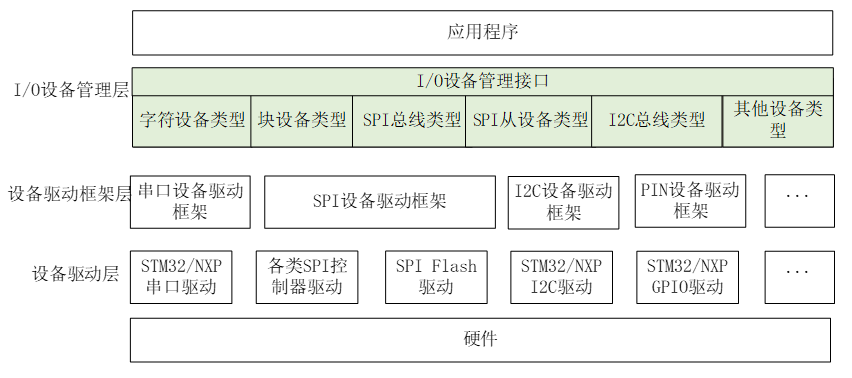

LED设备
================================

基于rtthread的rk2108 LED相关驱动开发与记录。

设计概要
----------------

基于RT-thread设备驱动模型开发，将文件分为drv_led.c/h 以及app_led.c/h，
其中drv_led.c/h文件为led的底层逻辑实现，设置LED状态时只需调用app_led.c/h提供的接口即可。
控制LED最基础的需求就是控制LED的亮灭情况，若是单单的控制亮灭并不需要编写所谓的LED驱动，直接调用简单的IO高低电平控制接口即可，
产品中往往使用LED的闪烁情况来作为设备工作模式的一个判断，产品设计者赋予led闪烁的新含义，
例如led正常闪烁表示正在工作，缓慢闪烁表示设备电量不足等。

led设备包含了控制各种led闪烁情况的逻辑，例如led快闪、led慢闪、亮3秒后熄灭等状态设置，同时LED设备能够灵活添加新的LED引脚以及
添加不同的闪烁模式，以便用户进行扩展开发。

功能需求
^^^^^^^^^^^^^^

1. 能够灵活设置不同的LED闪烁状态。
2. 能够方便设置添加新的用户引脚。
3. 能够方便添加不同led闪烁状态。

设计原则
^^^^^^^^^^^^^^

1. 模块化，减少代码耦合
2. 兼容性，能保证不同模块可复用相似借口，避免代码冗余
3. 层次分明，逻辑/数据层划分要清晰
4. 实现多平台代码复用

软件设计
----------------

RT-thread设备驱动模型
^^^^^^^^^^^^^^^^^^^^^^^

RT-Thread 提供了一套 I/O 设备模型框架，位于硬件和应用程序之间，共分成三层，
分别为 I/O 设备管理层、设备驱动框架层、设备驱动层。

- I/O 设备管理层实现了对设备驱动程序的封装，应用程序通过 I/O 设备层提供的标准接口访问底层设备。
- 设备驱动框架层是对同类硬件设备驱动的抽象，将不同厂家的同类硬件设备驱动中相同的部分抽取出来，
  将不同部分留出接口，由驱动程序实现。
- 设备驱动层是一组驱使硬件设备工作的程序，实现访问硬件设备的功能。

访问I/O设备
^^^^^^^^^^^^^^^

应用程序通过I/O设备管理接口来访问硬件设备，当设备驱动实现后，应用程序就可以访问该硬件。
I/O设备管理接口与I/O设备的操作方法的映射关系如下

.. image:: media/io-fun-call.png
   :align: center
   :alt:  IO 设备模型框架

LED设备驱动实现
^^^^^^^^^^^^^^^^^^^^^

程序实现步骤
""""""""""""""

1. 实现rt_led_init与rt_led_control函数
2. 注册LED设备
3. 通过rt_device_find找到相关设备
4. 调用rt_device_init初始化设备，会自动创建一个定时器对LED状态进行管理。
5. 使用rt_device_control控制LED GPIO引脚、LED状态、设置定时器相关回调等。

rt_device_control控制命令
"""""""""""""""""""""""""""""

LED设备的控制命令有以下几种，分别为LED初始化、设置LED所在的引脚、设置LED状态、
启动LED设备，设置用户回调函数等。

.. code-block:: c
   :caption: flash status
   :linenos:

   #define RT_LED_CTRL_LED_INIT        (1)
   #define RT_LED_CTRL_SET_LED_GPIO    (2)   
   #define RT_LED_CTRL_SET_STATE       (3)
   #define RT_LED_CTRL_START           (4)
   #define RT_LED_CTRL_TIMER_CALL      (5)

LED状态
""""""""""""""

默认现有的LED状态有以下几种，当有其他的应用场景时，可再添加其他模式。

.. code-block:: c
   :caption: flash status
   :linenos:

   #define LED_STS_INVALID                 0xFF
   #define LED_STS_OFF                     0
   #define LED_STS_ON                      1
   #define LED_STS_FLASH_SLOW              2
   #define LED_STS_FLASH_NORMAL            3
   #define LED_STS_FLASH_FAST              4
   #define LED_STS_BREATH                  5
   #define LED_STS_ALTERNATE_FLASH         6
   #define LED_STS_ON_3S                   7

用户调用接口
^^^^^^^^^^^^^^^^^^^^^

除了调用rt_device_init、rt_device_control接口能够对LED设备进行操作之外，同时也提供了
统一的用户层接口方便使用，接口如下

.. code-block:: c
   :caption: 用户接口
   :linenos:

   rt_err_t led_dev_init(void);
   rt_err_t led_dev_start(void);
   void led_dev_gpio_set(unsigned char idx,unsigned int gpio);
   void led_dev_work_state(unsigned char idx, unsigned int type, unsigned char io_init_state);
   void led_dev_timer_call_func(void *func);

使用示例
^^^^^^^^^^^^^^

.. code-block:: c
   :caption: 使用示例
   :linenos:

   int app_led_mgr_init(void)
   {
      led_dev_init();
      
      led_dev_gpio_set(LED_INDEX_POWER_GREEN,GPIO_LED_POWER_GREEN);
      led_dev_gpio_set(LED_INDEX_POWER_RED,GPIO_LED_POWER_RED);
      led_dev_gpio_set(LED_INDEX_MUTE_GREEN,GPIO_LED_MUTE_GREEN);
      led_dev_gpio_set(LED_INDEX_MUTE_RED,GPIO_LED_MUTE_RED);
      
      led_dev_timer_call_func((void *)app_led_set_poll);

      led_dev_start();

      return 0;
   }

.. code-block:: c
   :caption: 使用示例
   :linenos:

   void app_led_set_poll()
   {
      if (factory_need_led_test())
      {
         return;
      }
      app_mute_led_set_poll();
      app_power_led_set_poll();
   }

.. code-block:: c
   :caption: 使用示例
   :linenos:

   void app_power_led_set_poll(void)
   {
      static uint32_t count;

      if( led_power_ctl.set_power_led_en )
      {
         count = 0;
         led_power_ctl.set_power_led_en = 0;
      
         switch ( power_led_get_status() )
         {
               case LED_POWER_GREEN_BOOT:  
                  led_dev_work_state(LED_INDEX_POWER_RED, LED_STS_OFF, LED_LEVEL_OFF);
                  led_dev_work_state(LED_INDEX_POWER_GREEN, LED_STS_ON_3S, LED_LEVEL_ON);               
                  break;
                  
               case LED_POWER_RED_FAST_3_TIMES:  
                  led_dev_work_state(LED_INDEX_POWER_RED, LED_STS_FLASH_FAST, LED_LEVEL_ON);
                  led_dev_work_state(LED_INDEX_POWER_GREEN, LED_STS_OFF, LED_LEVEL_OFF);                  
                  break;

               case LED_POWER_RED_SLOW:  
                  led_dev_work_state(LED_INDEX_POWER_RED, LED_STS_FLASH_SLOW, LED_LEVEL_ON);
                  led_dev_work_state(LED_INDEX_POWER_GREEN, LED_STS_OFF, LED_LEVEL_OFF);                 
                  break;

               case LED_POWER_RED_CHARGEOFF:  
                  led_dev_work_state(LED_INDEX_POWER_RED, LED_STS_OFF, LED_LEVEL_OFF);
                  led_dev_work_state(LED_INDEX_POWER_GREEN, LED_STS_OFF, LED_LEVEL_OFF); 
                  break;
                  
               case LED_POWER_RED_CHARGING:  
                  led_dev_work_state(LED_INDEX_POWER_RED, LED_STS_ON, LED_LEVEL_ON);
                  led_dev_work_state(LED_INDEX_POWER_GREEN, LED_STS_OFF, LED_LEVEL_OFF);                 
                  break;
                                                   
               case LED_POWER_GREEN_CHARGEFINISH: 
                  led_dev_work_state(LED_INDEX_POWER_RED, LED_STS_OFF, LED_LEVEL_OFF);
                  led_dev_work_state(LED_INDEX_POWER_GREEN, LED_STS_ON, LED_LEVEL_ON);               
                  break;

               default:
                  break;
               
         }
      }
      else
      {
         if( LED_POWER_GREEN_BOOT == power_led_get_status() )   
         {
               count++;
               if( (LED_TIME_1S > 0) && (!(count%LED_TIME_1S))   )
               {
                  led_dev_work_state(LED_INDEX_POWER_RED, LED_STS_OFF, LED_LEVEL_OFF);
                  led_dev_work_state(LED_INDEX_POWER_GREEN, LED_STS_OFF, LED_LEVEL_OFF);                 
               }            
         }
         else if ( LED_POWER_RED_FAST_3_TIMES == power_led_get_status() )
         {
               count++;
               if( (LED_TIME_1S > 0) && (!(count%(3*LED_TIM_FAST_FLASH/LED_POLL_TIMER_PERIOD))   ))
               {
                  led_dev_work_state(LED_INDEX_POWER_RED, LED_STS_OFF, LED_LEVEL_OFF);
                  led_dev_work_state(LED_INDEX_POWER_GREEN, LED_STS_OFF, LED_LEVEL_OFF);                 
               }                
         }        
      }
      
   }

其他
-------------

- 使用链表的方式灵活添加无限制LED个数，而不修改驱动代码
- 使用链表方式添加新的LED状态，而不修改驱动代码

参考资料
-----------

RT-thread文档中心: https://www.rt-thread.org/document/site/#/rt-thread-version/rt-thread-standard/README

