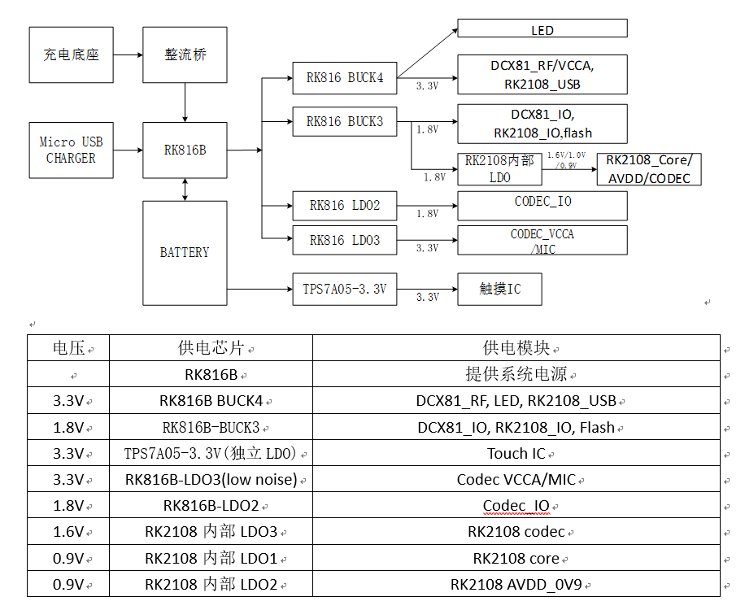

电源管理
================================

基于rtthread的rk2108 电源管理相关驱动开发与记录。

设计概要
----------------

RK816是一颗电源管理集成电路(PMIC)，适用于锂离子聚合物电池驱动的多核系统应用，或由5V输入来自usb端口或形成适配。
提供了一个完整的电源管理解决方案，RK816提供了四个可配置的同步降压转换器(BUCK)和六个LDO监管机构。

电源树
^^^^^^^^^^^^^^

功能需求
^^^^^^^^^^^^^^

- 充电功能：能够设置USB最大输入电流、最大充电电压、最大充电电流、充电截止电流。
- 开启关闭充电功能
- 获取充电状态
- 获取电池电量等相关信息
- 获取NTC温度
- 使能及失能buck、LDO电源

设计原则
^^^^^^^^^^^^^^

1. 模块化，减少代码耦合
2. 兼容性，能保证不同模块可复用相似借口，避免代码冗余
3. 层次分明，逻辑/数据层划分要清晰
4. 实现多平台代码复用

底层驱动软件设计
----------------

在rk提供的sdk上主要将rk816的驱动分为两个设备:charger及fuel_gauge，用于基础的充电部分以及功能设置部分。 

charger设备
^^^^^^^^^^^^^^

charger设备在驱动实现上仅使用了rt_device_control用于控制设备

charger设备控制命令
""""""""""""""""""""

.. code-block:: c
   :caption: charger cmd
   :linenos:

    #define RT_DEVICE_CTRL_CHAGER_LIMIT_GET     (1) /* Get min, max */
    #define RT_DEVICE_CTRL_CHAGER_STATUS_GET    (2) /* Get current configure */
    #define RT_DEVICE_CTRL_CHAGER_BATVOL_SET    (3) /* Set battery charge voltage */
    #define RT_DEVICE_CTRL_CHAGER_BATCUR_SET    (4) /* Set battery charge current */
    #define RT_DEVICE_CTRL_CHAGER_FNSCUR_SET    (5) /* Set battery finish current */
    #define RT_DEVICE_CTRL_CHAGER_SRCCUR_SET    (6) /* Set adapter input source current */
    #define RT_DEVICE_CTRL_CHAGER_EN_SET        (7) /* Set battery charge en */

fuel_gauge设备
^^^^^^^^^^^^^^^^

fuel_gauge设备在驱动实现上实现了rt_device_init、rt_device_control两个函数用于控制设备，
其中rt_device_init用于初始化rk816内部相关寄存器。

.. 并创建rk816_fg_main_thread线程，用于监控

fuel_gauge设备控制命令
"""""""""""""""""""""""

.. code-block:: c
   :caption: fuel_gauge cmd
   :linenos:

    #define RT_DEVICE_CTRL_SHUTDOWN         (1) /* Set fuel shutdown */
    #define RT_DEVICE_CTRL_FG_GET           (3) /* Get fuel gauge status */
    #define RT_DEVICE_BUCKX_CONTROL_EN      (4) /* Set fuel ldx work mode */
    #define RT_DEVICE_LDX_CONTROL_EN        (5) /* Set fuel ldx work mode */
    #define RT_DEVICE_GG_CONTROL_EN         (6) /* Set fuel GG work mode */
    #define RT_DEVICE_ADC_TS_CONTROL_EN     (7) /* Set fuel ADC_TS work mode */
    #define RT_DEVICE_RTC_CONTROL_EN        (8) /* Set fuel RTC work mode */
    #define RT_DEVICE_GPIO_SLEEPPIN_LEVEL   (20) /* Set fuel sleep pin level */
    #define RT_DEVICE_BUCK_SLP_FORCEPWM     (30) /* Set fuel froce pwm mode */
    #define RT_DEVICE_RTC_TIMER_INT_EN      (40) /* Set fuel RTC period interrupt mode */

用户调用接口
^^^^^^^^^^^^^^^^

若使用RT-thread提供的设备IO接口，对rk816电源管理芯片的控制显得较为繁琐，
在编写应用层程序时仅仅想知道现在电池是否在充电及电池剩余电量等信息，
因此提供了以下接口

.. code-block:: c
   :caption: 用户调用接口
   :linenos:

    struct rt_power_ctl * rk_power_mgr_init(struct st_power_para * power_para);
    rt_err_t rk_charge_process(unsigned char *p_rep);
    int rk_ntc_process(void);

    int rk_power_ldx_control_en(unsigned char ldx, unsigned char en);
    int rk_power_buckx_control_en(unsigned char buckx, unsigned char en);
    int rk_power_fg_set_slp_fpwm(rt_device_t dev, unsigned char buck);

    int rk_power_rk2108_ldox_control_en(unsigned char ldox, unsigned char en);

    void rk_power_mgr_sleep_mode_enter(void);
    void rk_power_mgr_sleep_mode_exit(void);
    int rk_power_mgr_shutdown(const char *pfun, int line);

    #define FUN_SHUTDOWN_DEV    rk_power_mgr_shutdown(__FUNCTION__,__LINE__)

业务相关软件设计
-------------------

电源管理相关应用逻辑
^^^^^^^^^^^^^^^^^^^^

电源管理相关逻辑设计涉及内容较多包括如下几种

- 电源指示灯逻辑，实现充电状态显示、电池电量过低报警闪烁等。
  
  1. 绿灯长亮----电量已充满
  #. 红灯慢闪----低电量，请充电
  #. 红灯快闪3次熄灭----电量低无法开机
  #. 绿灯亮3s熄灭----待机中
  #. 绿灯亮1s熄灭----开机成功

- 开关机逻辑

  1. 开机时检测上次若是低电量关机并未插入USB，电源红灯闪烁3次并直接关机
  #. 处于低电量模式，10分钟后关机。
  #. 电池电量为0或电压太低时自动关机。

- 充电逻辑
  
  1. 不同电池电量下充电电流大小的设置
  #. 不同温度下充电电流大小的设置

- 低功耗与退出低功耗相关代码实现
  
  1. 调用指定接口进入低功耗模式
  #. 调用指定接口退出低功耗模式

.. code-block:: c
   :caption: 软件框架

   void power_thread(void *para)
   {
      1.开机亮绿灯
      2.设置power_para参数---设置中断回调函数、设置进入\退出休眠模式参数
      3.调用rk_power_mgr_init(&power_para) 初始化rk816相关
      4.低电量开机检查rk_lowpower_startup_check()
          若上次以低电量关机，并检测到未插入usb则红灯快速闪3次关机
      
      while(1)
      {
        1.检测到唤醒标志时，退出低功耗模式
        2.获取电池以及充电状态
        3.设置LED状态
        4.低电量逻辑判断
        5.获取ntc温度	
      }
   }

